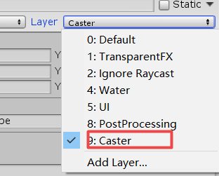
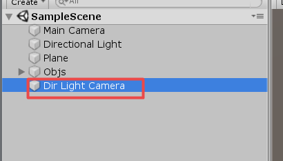
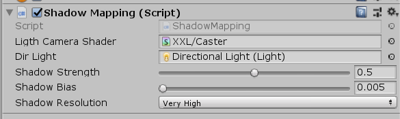
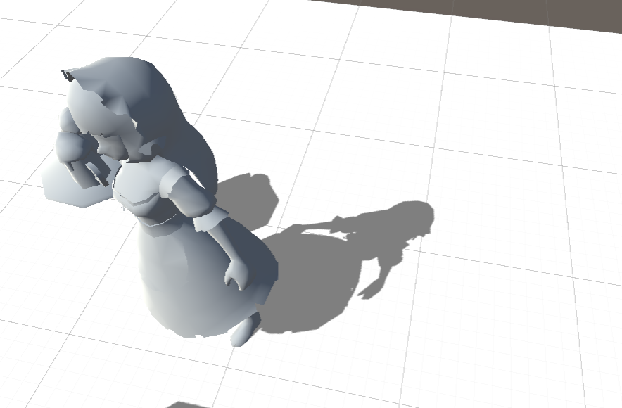
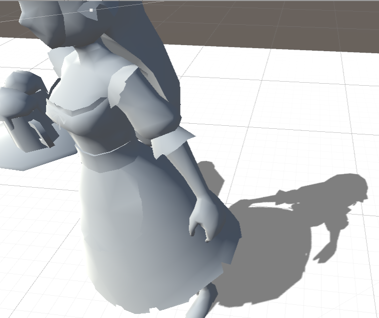
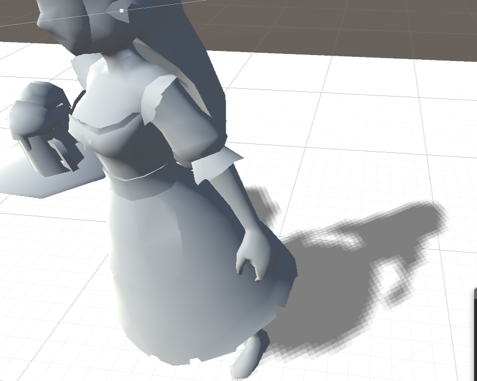

Achieved Shadow Mapping by Unity
--------------------------------------
注意：

1.投影的物体请设置为Caster层，如果没有Caster层，请手动添加。

2.投影的物体请把Render组件对应的Cast Shadows关闭，Receive Shadows关闭。

3.Dir Light Camera 为自动生成的光源位置相机。

4.ShadowMapping脚本挂在MainCamera上，对应的参数请自行调整

TODO:
1.PCF（完成）

2.运行时切换分辨率(完成)

Shadow Resolution=Very High

Shadow Resolution=Low

3.others，想到再补充吧！

ShadowMappingEx

这个文件夹中更加系统的实现了ShadowMapping

1.Hard

2.PCF

3.VSM

4.MOMENT